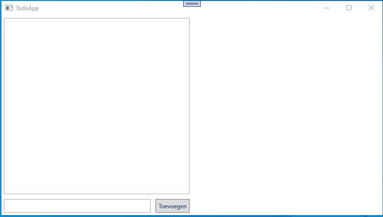

# Todo Applicatie

Schrijf per twee of alleen (naar keuze), een applicatie die er voor zorgt dat je todolijstjes kan bijhouden.

Wanneer je per 2 werkt, maak gebruik van pair programming.

**deadline:** 08/06/22 09:00

## Gegeven

In deze repo vind je een startproject. Dit startproject bevat de basis van een MVVM applicatie. Hierbij zijn al enkele zaken voor jou voorzien.

In de `MainWindow.xaml` file, is de volledige lay-out al voorzien met de nodige bindings.

In de file `MainViewModel.cs` kan je alle gebinde properties en commands terug vinden. Voor de meeste properties is het `NotifyPropertyChanged` event al voorzien. Normaal hoef je dit niet meer toe te voegen. De methodes die achter de commands zitten die moet je zelf nog implementeren zodat de applicatie werkt.

Tot slot vind je ook al 2 model klasses terug die je gaat nodig hebben. De implementatie hiervan moet je echter wel zelf schrijven.

## Gevraagd

We willen een applicatie om todolijstjes bij te houden. We willen meerdere lijstjes kunnen bijhouden met telkens meerdere todo-items.

Onderaan rechts kan je nieuwe lijstjes aanmaken door een waarde in de textbox te plaatsen en op toevoegen te klikken. Standaard wordt dit nieuwe lijstje geopend.

Links in het scherm kunnen we voor een bepaalde lijst enkele zaken doen:

- de naam van de lijst wijzigen
- Items toevoegen aan een lijst
- Items afvinken
- Items verwijderen
- De lijst verwijderen

Zorg ervoor dat alle data ook in een database wordt bijgehouden en wijzigingen ook direct worden opgeslagen in de databank.

## Stappenplan

**Werk in kleine stappen!**

Zorg er eerst voor dat je applicate database-ready is. Dit wil zeggen:

- Het framework is toegevoegd
- Je hebt een connectionString
- Je hebt een klasse die overerft van DbContext. Met 2 DbSets in dit geval:
  - 1 voor TodoLists
  - 1 voor TodoItems

Maak vervolgens je dataKlasses aan. Zorg ervoor dat alles aanwezig is om deze klasses te gebruiken in een database applicatie.

Voorzie de nodige datarepository klasses. Je kan met 1 repository klasse werken. Dit is het gemakkelijkste, hier treden iets minder problemen op. Beter is te werken met 2 repository klasses, zodat je de logica beter gaat scheiden. Je moet hier nog geen implementatie voorzien. Doe dit terwijl je de applicatie uitbreid.

Begin nu met het toevoegen van features in je viewModel. Belangrijk: Spreek nooit de DbContext klasse rechtstreeks aan in je ViewModel. Gebruik de data repository klasses om data te manipuleren of op te vragen.

Zorg steeds dat een bepaalde feature werkt alvorens verder te gaan:

- Inladen van lijsten bij opstart van de applicatie
- Een nieuw lijstje toevoegen en de lijst van todolists opnieuw inladen
- Een todolist selecteren en de todoitems hieruit tonen.
- Een todoitems toevoegen aan een lijst en de todoitems van de todolist herladen
- Een todoitem afvinken en de todoitems van de todolist herladen
- Een todoitem verwijderen en de todoitems van de todolist herladen
- Een naam van todolist veranderen en de todolists herladen.
- Een Todolist verwijderen en de todolists herladen

Als deze basics goed werken. Kan je kijken waar je kan optimaliseren.

- Buttons enablen of disablen.
- Velden automatisch leeg maken
- Kijken of alle listboxen de correcte data bevatten.
